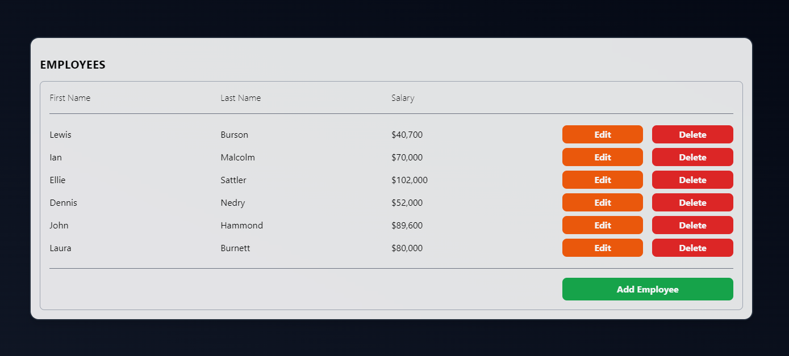

# Take-home Assignment (Full Stack)

### Goal:

- Create an Employee Table like the one in the image below.
- Use any front-end framework (Angular, React, Vue, ect...) or CSS library to accomplish this.
- Implement the back-end API with the back-end framework of your choice, and a SQL database

### Functional Requirements:

- Initially, list all employees that are in data.json
  - First name, last name, and salary in currency format (ie. $42,000)
- The ability to edit an employee
- The ability to delete an employee
- The ability to create a new employee

### Technical Guidelines:

- Structure your application and components in a modular/reusable way
- Commit code with useful and informative comments
- Your application doesn't have to use the data.json file directly, but have a SQL script to initialize your database with data found in that file
- Implement API code to read and write to a SQL database
- Styling: CSS or SCSS or SASS can be used, whichever you prefer (can use popular UI frameworks like Bootstrap as well)

### Questions?

Please reach out to me with any questions

# My Implementation

For this task, I used a React/Tailwind frontend with a Nodejs/Expressjs backend interfacing with a SQLite database using the ORM Prisma. I skewed away from the design example followed and went with my own as allowed. Everytime I had a new feature or a bug fix/type I commited to the main branch of the repo. In a real world scenario working on a team I would first create a branch, though since I was working on this alone I decided that feature branches would be a bit much (though if I was going to experiment on changing something that already works I would do a branch then). 

## How to run

1. Clone the repo to your machine using `git clone https://github.com/Eliksni/employee-table.git`

2. cd to the frontend folder and install the packages using `npm i`

3. Build the frontend using `npm run build`

4. cd to the backend folder and install the packages using `npm i`

5. Create a environment variable file `.env` and insert `DATABASE_URL="file:./dev.db"` into it

6. Initialize the database using `npx prisma migrate dev --name init`. This will create the SQLite database and corresponding SQL to create the table

7. Add the initial JSON data using `node importData` to add the data using the JS script

8. Run the server using `npm run dev` and connect to  `http://localhost:3001`
